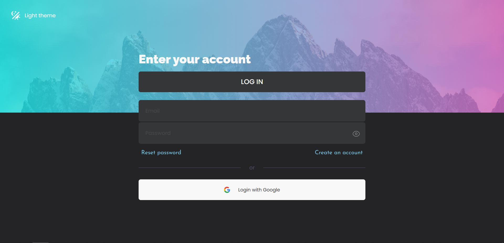
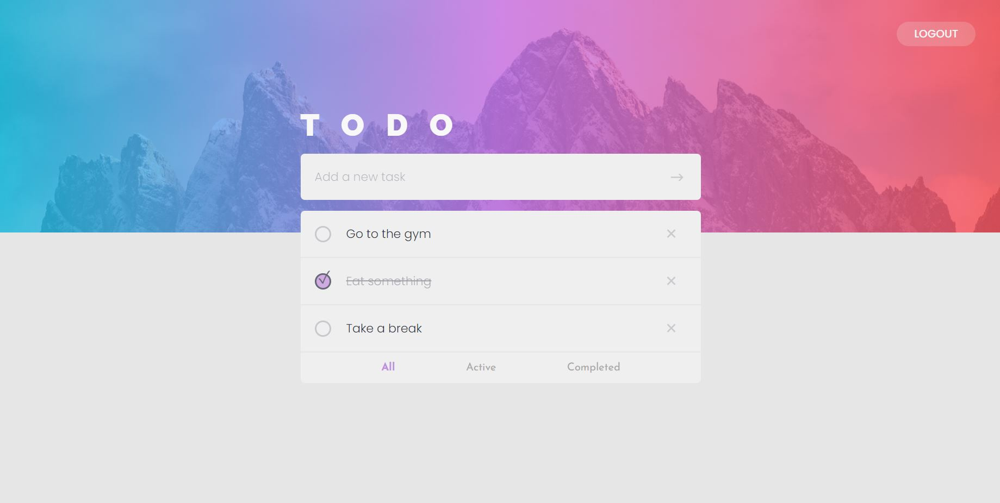
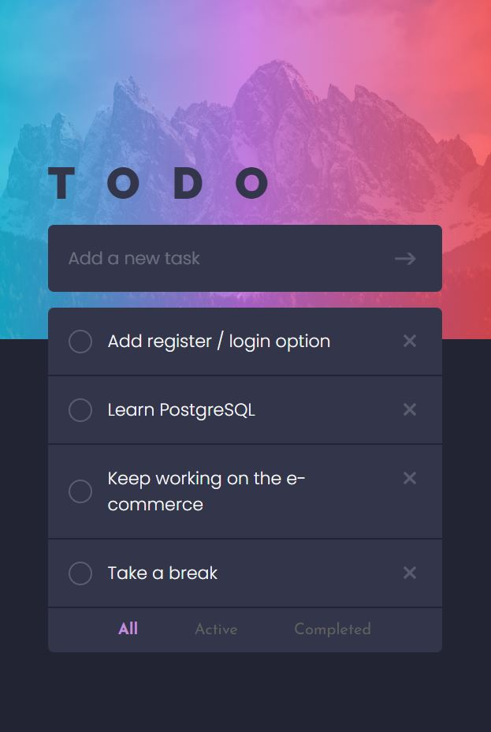
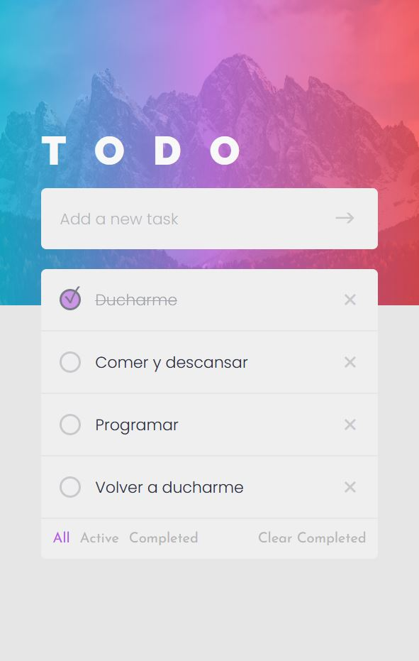

# Simple To-Do app
- Mongo, Express, React, Node
- TypeScript

## Features
- Add new tasks
- Edit existing tasks (double click) (click outside to save)
- Delete tasks
- Browse all, active, completed tasks
- Delete all completed tasks
- Automatic Light / Dark mode

# Screenshots
### desktop

### mobile

## Issues
- If delete all completed tasks from completed tab, it will show the empty list text till page is reloaded

### Thanks
- Design from: [Frontend Mentor](https://www.frontendmentor.io/challenges/todo-app-Su1_KokOW)
