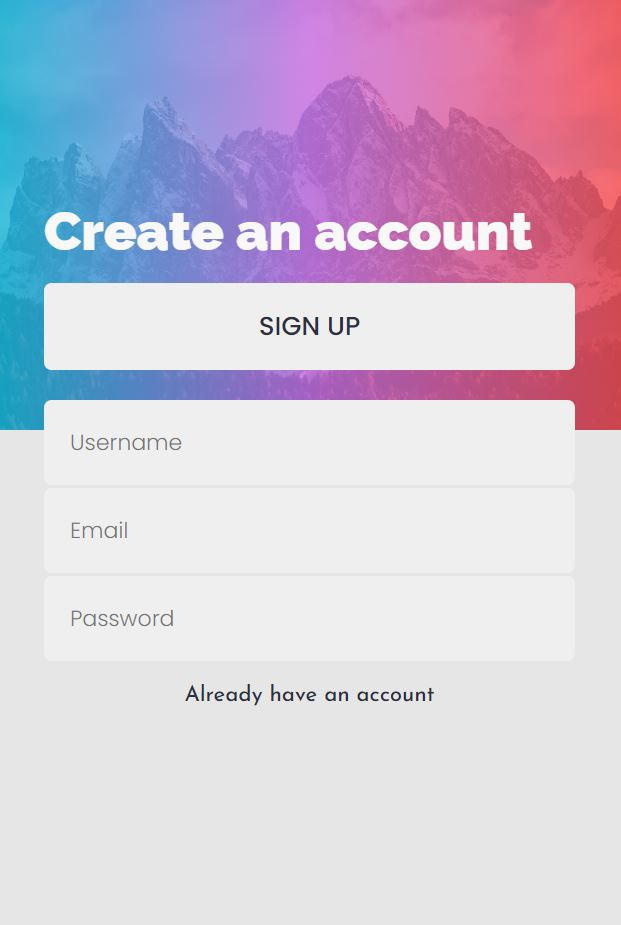
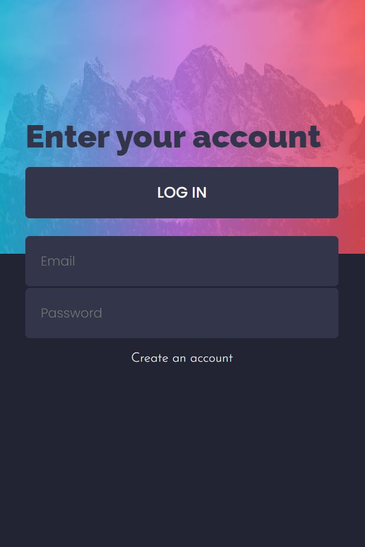

# Simple To-Do app
- PostgreSQL, Express, React, Node
- TypeScript

## Features
- Register / Login
- Add new tasks
- Edit existing tasks (double click) (click outside to save)
- Delete tasks
- Browse all, active, completed tasks
- Automatic Light / Dark mode

# Screenshots
### desktop

### mobile

### Thanks
- Design from: [Frontend Mentor](https://www.frontendmentor.io/challenges/todo-app-Su1_KokOW)

*NOTE:* apart from design idea, nothing else, from the challenge, have been used.
